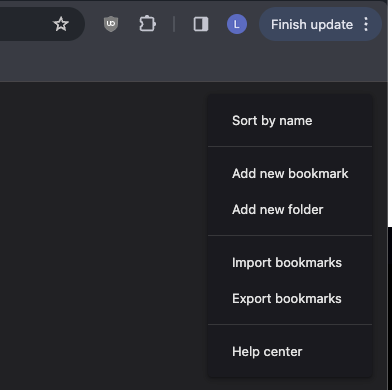

I've seen a few people recently on Twitter mention the idea of hosting/storing bookmarks and links their websites. For whatever reason - it hit home with me and sounded like an awesome idea!

I wanted to make it as easy as possible. Naturally, JSON sounds like a great way to organize them for my implementation. That said, I didn't really want to build a new process around maintaining a JSON file manually. I enjoy the bookmarking experience in Chrome, even though I would say I'm picky about what I actually bookmark.

So - I found the button in Google Chrome that allows you to export your bookmarks via [chrome://bookmarks/](chrome://bookmarks/)



This generates an HTML file of the format `<!DOCTYPE NETSCAPE-Bookmark-file-1>` that lists your bookmarks by folder with: `URL`, `Added Date`, `Favicon`, and of course `Title`. Naturally, you can see how all of this would be useful for generating a JSON file to reference in an Astro page/component.

I copied that file into a local directory `/src/content/bookmarks` and setup the JavaScript below to build a `bookmarks.json` at build time. There are a few known caveats:

- I added the `.html` to `.gitignore` so my personal bookmarks aren't leaked to GitHub
- I plan on building/generating this locally (right now)
- I plan on deleting `bookmarks.json` and copying in a new `bookmarks.html` whenever I want to update the list.
- I'm curating these links under a `Published Bookmarks` folder.

```js
import fs from 'fs';
import path from 'path';
import { JSDOM } from 'jsdom';

function parseBookmarksHtml(html) {
    const dom = new JSDOM(html);
    const doc = dom.window.document;
    const publishedSection = Array.from(doc.querySelectorAll('dt > h3')).find(h3 => h3.textContent.includes('Published Bookmarks'));
    const links = publishedSection ? publishedSection.nextElementSibling.querySelectorAll('a') : [];
    const bookmarks = Array.from(links).map(link => ({
        title: link.textContent.trim(),
        href: link.getAttribute('href'),
        add_date: new Date(parseInt(link.getAttribute('add_date')) * 1000).toISOString(),
        icon: link.getAttribute('icon')
    }));
    return bookmarks;
}

function loadAndConvertHtmlFile(filePath) {
    try {
        const htmlContent = fs.readFileSync(filePath, 'utf8');
        return parseBookmarksHtml(htmlContent);
    } catch (error) {
        throw new Error(`Failed to load or parse HTML file: ${filePath}`);
    }
}

async function processBookmarksFolder(folderPath) {
    const allBookmarks = [];  // Array to store all bookmarks

    const files = fs.readdirSync(folderPath);
    for (const file of files) {
        if (path.extname(file).toLowerCase() === '.html') {
            const filePath = path.join(folderPath, file);
            try {
                const bookmarks = loadAndConvertHtmlFile(filePath);
                allBookmarks.push(...bookmarks);  // Add bookmarks to the array
            } catch (error) {
                console.log('Error processing file:', file, error);
            }
        }
    }

    // Only write to bookmarks.json if allBookmarks is not empty
    if (allBookmarks.length > 0) {
        const jsonFilePath = path.join(folderPath, 'bookmarks.json');
        fs.writeFileSync(jsonFilePath, JSON.stringify(allBookmarks, null, 2));
        console.log('All bookmarks saved to:', jsonFilePath);
    } else {
        console.log('No bookmarks found. bookmarks.json was not overwritten.');
    }
}

// Astro integration
export function generateBookmarks({ bookmarksPath = './src/content/bookmarks' }) {
    return {
        name: "generate-bookmarks",
        hooks: {
            "astro:build:setup": async ({ logger }) => {
                try {
                    await processBookmarksFolder(bookmarksPath);
                    logger.info("Bookmark generation completed.");
                } catch (e) {
                    logger.error("Error in Bookmark generation:", e);
                }
            }
        }
    };
}
```

All of this could be iterated on - and probably done better. This works for me right now - and is a great starting place to hosting a `Links` page on my website. If you have suggestions or ideas - feel free to @ me on X/Twitter 🙂